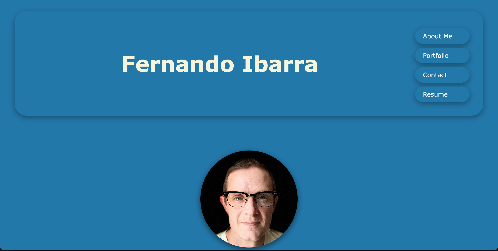
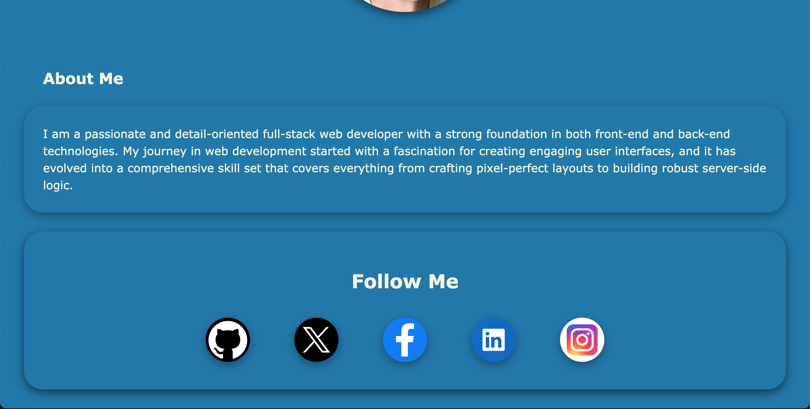
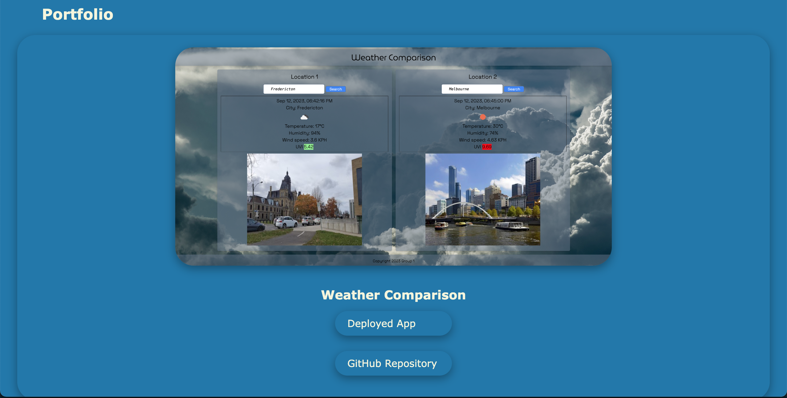
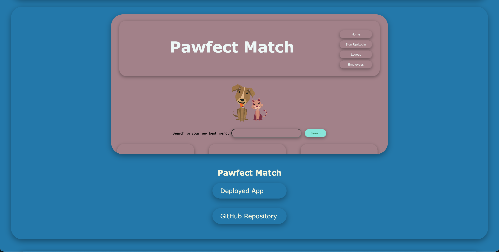
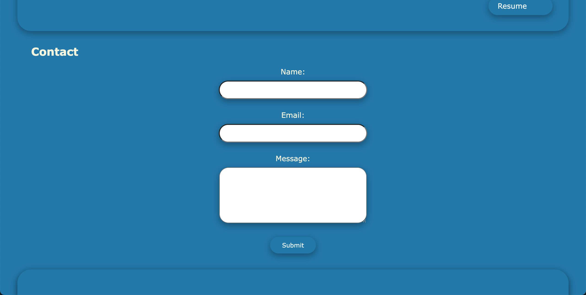
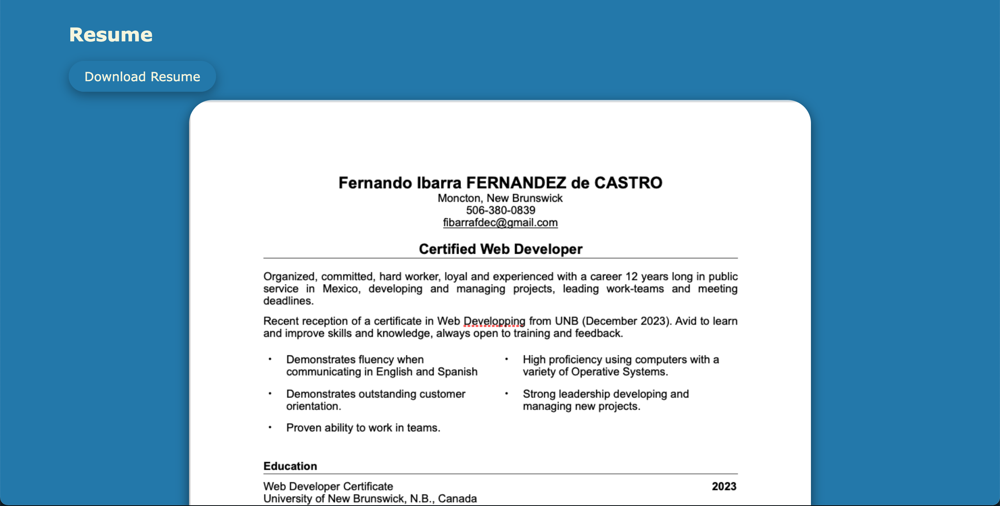

# React-Portfolio-FIFDEC

## Description
The React Personal Portfolio is a dynamic and interactive web application designed to serve as a showcase for a developer's projects, skills, and resume. This modern and responsive portfolio is built using React, a powerful JavaScript library for building user interfaces. The portfolio provides a visually appealing and user-friendly experience, allowing visitors to explore the developer's work and learn more about their expertise.

[](https://opensource.org/licenses/MIT)

## Table of Contents:

- [Overview](#Overview)
- [The Challenge](#Challenge)
- [User Story](#User-Story)
- [Acceptance Criteria](#Acceptance-Criteria)
- [GIF](#GIF)
- [Installation Instructions](#Installation-Instructions)
- [Usage Instructions](#Usage-Instructions)
- [Technologies Used](#Technologies-Used)
- [Deployed Application Link](#Deployed-Application-Link)
- [Screenshots](#Screenshots)
- [Test](#Test)
- [Questions](#Questions)
- [Credits](#Credits)
- [License](#License)

# Overview

## Challenge
"Create a portfolio, using your new React skills to help set you apart from other developers whose portfolios don’t use the latest technologies.

For this module challenge, you’ll need to deploy this application to Netlify Links to an external site."

## User Story

```md
AS AN employer looking for candidates with experience building single-page applications
I WANT to view a potential employee's deployed React portfolio of work samples
SO THAT I can assess whether they're a good candidate for an open position.
```

## Acceptance Criteria

```md
GIVEN a single-page application portfolio for a web developer
WHEN I load the portfolio
THEN I am presented with a page containing a header, a section for content, and a footer
WHEN I view the header
THEN I am presented with the developer's name and navigation with titles corresponding to different sections of the portfolio
WHEN I view the navigation titles
THEN I am presented with the titles About Me, Portfolio, Contact, and Resume, and the title corresponding to the current section is highlighted
WHEN I click on a navigation title
THEN I am presented with the corresponding section below the navigation without the page reloading and that title is highlighted
WHEN I load the portfolio the first time
THEN the About Me title and section are selected by default
WHEN I am presented with the About Me section
THEN I see a recent photo or avatar of the developer and a short bio about them
WHEN I am presented with the Portfolio section
THEN I see titled images of six of the developer’s applications with links to both the deployed applications and the corresponding GitHub repository
WHEN I am presented with the Contact section
THEN I see a contact form with fields for a name, an email address, and a message
WHEN I move my cursor out of one of the form fields without entering text
THEN I receive a notification that this field is required
WHEN I enter text into the email address field
THEN I receive a notification if I have entered an invalid email address
WHEN I am presented with the Resume section
THEN I see a link to a downloadable resume and a list of the developer’s proficiencies
WHEN I view the footer
THEN I am presented with text or icon links to the developer’s GitHub and LinkedIn profiles, and their profile on a third platform (Stack Overflow, Twitter).
```

## GIF

The following animation demonstrates the desired application functionality:


## Installation Instructions

This is an online Web Application deployed through Netlify, hence it doesn't need user's installation. 

## Usage Instructions
1. Open the web page using the link provided further in this README file, 
2. Read the presentation About Me, 
3. Click on Porfolio to see some awesome apps, 
4. Click Contact Me to send me a message.
5. Click on Resume to see my background.
6. Feel free to follow me on social media (footer),

## Technologies Used
- Node.js [Version 16.18.1](https://nodejs.org/en/blog/release/v16.18.1/)
- Express.js [Version 4.16.4](https://expressjs.com/)
- Visual Studio Code: [Website](https://code.visualstudio.com/)
- React: [Version 18.2.0](https://www.npmjs.com/package/react)
- React-Dom: [Version 18.2.0](https://www.npmjs.com/package/react-dom)
- React: [Version 18.2.0](https://reactjs.org)
- Netlify: [Website](https://app.netlify.com/)

## Deployed Application Link
[Deployed Application Link:](https://shimmering-sunburst-72607b.netlify.app/)

## Screenshots








## Test
This application has been tested running it with Live Server localhost 3000, and also after deployment with Netlify.

## Questions?

If you have any questions related with my Personal Portfolio, feel free to reach me through:

Email:[fibarrafdec@gmail.com](fibarrafdec@gmail.com)

GitHub username:[fibarrafdec](fibarrafdec)
GitHub link: https://github.com/fibarrafdec

## Credits
This application has been created by © 2023 Fernando Ibarra [fibarrafdec](https://github.com/fibarrafdec).

## License & Copyright ©
This application is covered under the MIT License.
[](https://opensource.org/licenses/MIT)

### Copyright © 2023 Fernando Ibarra
```md
Permission is hereby granted, free of charge, to any person obtaining a copy
of this software and associated documentation files (the "Software"), to deal
in the Software without restriction, including without limitation the rights
to use, copy, modify, merge, publish, distribute, sublicense, and/or sell
copies of the Software, and to permit persons to whom the Software is
furnished to do so, subject to the following conditions:

The above copyright notice and this permission notice shall be included in all
copies or substantial portions of the Software.

THE SOFTWARE IS PROVIDED "AS IS", WITHOUT WARRANTY OF ANY KIND, EXPRESS OR
IMPLIED, INCLUDING BUT NOT LIMITED TO THE WARRANTIES OF MERCHANTABILITY,
FITNESS FOR A PARTICULAR PURPOSE AND NONINFRINGEMENT. IN NO EVENT SHALL THE
AUTHORS OR COPYRIGHT HOLDERS BE LIABLE FOR ANY CLAIM, DAMAGES OR OTHER
LIABILITY, WHETHER IN AN ACTION OF CONTRACT, TORT OR OTHERWISE, ARISING FROM,
OUT OF OR IN CONNECTION WITH THE SOFTWARE OR THE USE OR OTHER DEALINGS IN THE
SOFTWARE.
```
